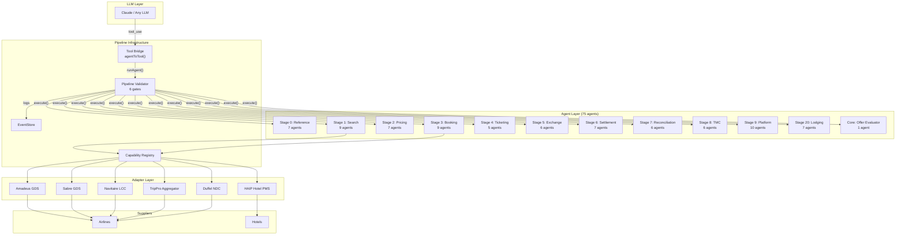
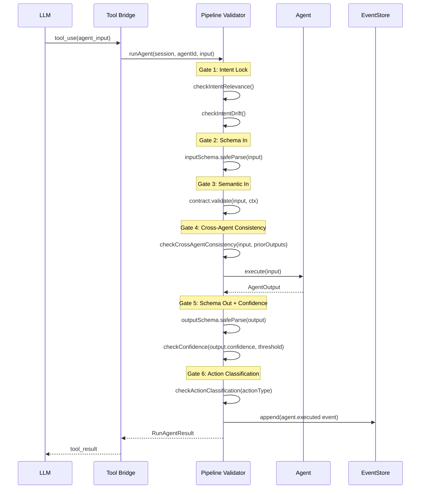
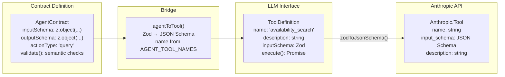
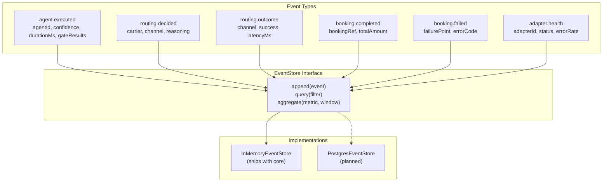

# OTAIP Architecture

> Contract-driven agent platform for travel distribution, powered by pipeline validation and LLM orchestration.

## High-Level Architecture



## Pipeline Validator Gate Sequence

Every agent invocation passes through six gates. Gates 1-3 run before `execute()`, gates 4-6 run after.



### Gate Details

| Gate | Name | Runs | Purpose |
|------|------|------|---------|
| 1 | Intent Lock | Before execute | Verifies the agent is relevant to the session intent and no drift occurred |
| 2 | Schema In | Before execute | Zod `safeParse` on the input data against `contract.inputSchema` |
| 3 | Semantic In | Before execute | Domain-specific validation via `contract.validate()` (airport codes, dates, etc.) |
| 4 | Cross-Agent | Before execute | Checks input fields are consistent with prior agent outputs in the session |
| 5 | Schema Out + Confidence | After execute | Validates output structure and checks `output.confidence >= threshold` |
| 6 | Action Classification | After execute | Enforces approval requirements for irreversible mutations |

### Confidence Floors

Confidence thresholds are enforced per action type. Contracts may declare higher thresholds, never lower.

| Action Type | Floor |
|-------------|-------|
| `query` | 0.70 |
| `mutation_reversible` | 0.90 |
| `mutation_irreversible` | 0.95 |
| Reference data agents | 0.90 (additional) |

## Tool Bridge: Agent to LLM

The tool bridge converts contracted agents into LLM-callable tools without hand-written JSON schemas.



### Contracted Agent Tool Names

These 14 agents have pipeline contracts with Zod schemas:

| Agent ID | Tool Name | Action Type |
|----------|-----------|-------------|
| 0.1 | `airport_code_resolver` | query |
| 0.2 | `airline_code_mapper` | query |
| 0.3 | `fare_basis_decoder` | query |
| 1.1 | `availability_search` | query |
| 2.1 | `fare_rule_agent` | query |
| 2.4 | `offer_builder` | mutation_reversible |
| 3.1 | `gds_ndc_router` | query |
| 3.2 | `pnr_builder` | mutation_reversible |
| 3.8 | `pnr_retrieval` | query |
| 4.1 | `ticket_issuance` | mutation_irreversible |
| 9.6 | `performance_audit` | query |
| 9.7 | `routing_audit` | query |
| 9.8 | `recommendation` | query |
| 9.9 | `alert` | query |

## EventStore

Every agent execution is logged to the EventStore with duration, gate results, and confidence. The store supports six event types:



Governance agents (9.6 PerformanceAudit, 9.7 RoutingAudit, 9.8 Recommendation, 9.9 Alert) query the EventStore to produce audit reports and recommendations.

## Package Structure

```
packages/
  core/                  @otaip/core — Agent interface, errors, pipeline validator,
                         tool bridge, EventStore, agent loop
  connect/               @otaip/connect — ConnectAdapter interface, BaseAdapter,
                         5 supplier adapters (Amadeus, Sabre, Navitaire, TripPro, HAIP)
  adapters/duffel/       @otaip/duffel — Standalone Duffel NDC adapter
  agents/
    reference/           @otaip/agents-reference — Stage 0 (7 agents)
    search/              @otaip/agents-search — Stage 1 (9 agents)
    pricing/             @otaip/agents-pricing — Stage 2 (7 agents)
    booking/             @otaip/agents-booking — Stage 3 (9 agents, incl. fallback-chain utility)
    ticketing/           @otaip/agents-ticketing — Stage 4 (5 agents)
    exchange/            @otaip/agents-exchange — Stage 5 (6 agents)
    settlement/          @otaip/agents-settlement — Stage 6 (7 agents)
    reconciliation/      @otaip/agents-reconciliation — Stage 7 (6 agents)
    lodging/             @otaip/agents-lodging — Stage 20 (7 agents)
  agents-tmc/            @otaip/agents-tmc — Stage 8 (6 agents)
  agents-platform/       @otaip/agents-platform — Stage 9 (10 agents)
```

## Design Principles

1. **Contract-first**: Agent behavior is declared through `AgentContract` with Zod schemas. No hand-written JSON schemas.
2. **Pipeline-validated**: Every agent call passes through 6 gates. The LLM cannot hallucinate offer IDs, change destinations mid-flow, or ticket without approval.
3. **Event-sourced observability**: Every execution is logged with duration, confidence, and gate results for governance agents to analyze.
4. **Adapter-agnostic**: Agents talk to a `DistributionAdapter` / `ConnectAdapter` interface. Swapping Amadeus for Sabre requires zero agent changes.
5. **Domain-safe**: No invented domain logic. Travel industry edge cases are surfaced as `DOMAIN_QUESTION` comments, not guessed.
